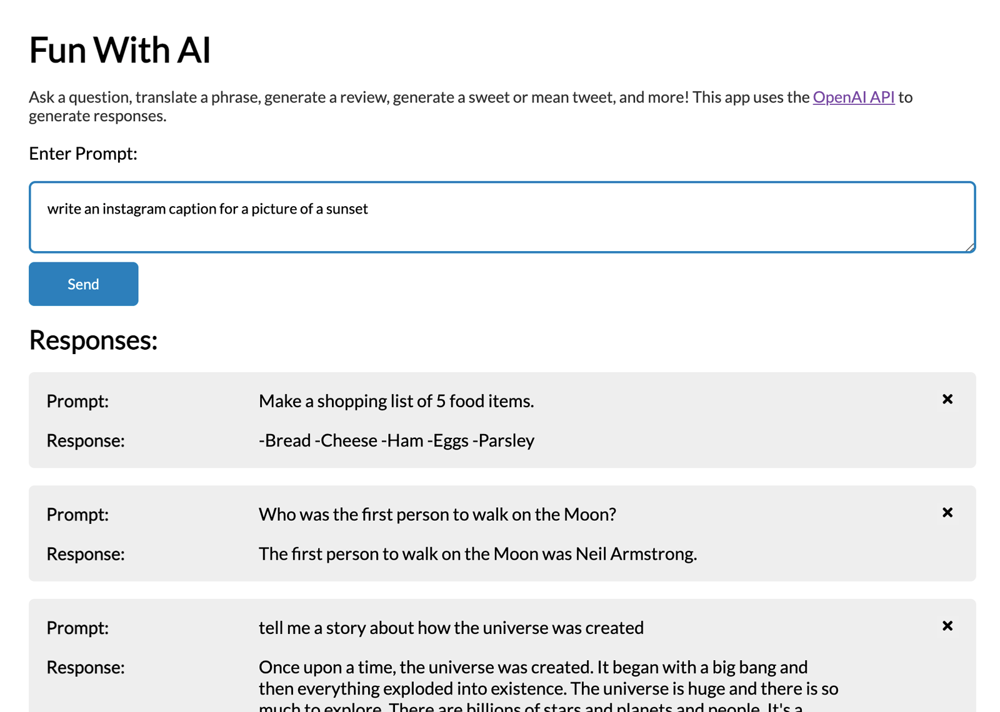

# Shopify Front End Developer Intern Challenge - Fun With AI

This is my solution to the Shopify Front End Developer Intern Challenge. I have created a user interface that makes a call to the [OpenAI API](https://beta.openai.com/) after typing in a prompt. What kind of a prompt, you may be asking? This API can answer questions, create reviews, extract keywords, generate tweets (both nice and mean), and so much more!

## Table of contents

- [Overview](#overview)
  - [Acceptance Criteria](#acceptance-criteria)
  - [Additional Features](#additional-features)
  - [Screenshot](#screenshot)
  - [Links](#links)
- [My process](#my-process)
  - [Built with](#built-with)
  - [Project Workflow](#project-workflow)
- [Author](#author)

## Overview

### Acceptance Criteria

User Interface & Technical Requirements

- A form for entering text prompts
- Submitting the form sends the prompt to the OpenAI API
- Results are displayed in a list, sorted from newest to oldest
- Each result should include the original prompt and a response from the API
- The HTML that ends up being served client-side should be accessible and semantic

### Additional Features

- Form validation to prevent the user from submitting an empty prompt
- Browser local storage, which saves responses if the user leaves or reloads the page
- Ability to delete a response from the list
- Adding/deleting responses has subtle animation to provide a more pleasing user interface

### Screenshot

### Links

- Live Site URL: [Fun With AI](https://astonishing-souffle-c49e51.netlify.app/)

## My process

### Built with

- React JS - JS library
- Framer Motion - Animation
- React-Icons
- Browser Local Storage
- Semantic HTML5 markup
- CSS custom properties
- Mobile-first workflow

### Project Workflow

I decided to use some of the Agile methodology workflow on this project to keep things well-defined with constant, achievable benchmarks. Before doing any coding, I created a handful of Github issues that would enable me to break up the project into bite-sized sections. For each feature, I created a feature branch in `Git`, and I created a pull request, just like how you would when working in a group. This was a great way to document the project, and I think it made for a better end result! Please check out the closed Github issues or pull requests if you'd like to see how I tackled the project.

## Author

- Website - [Chris Korsak](https://www.chriskorsak.net)
